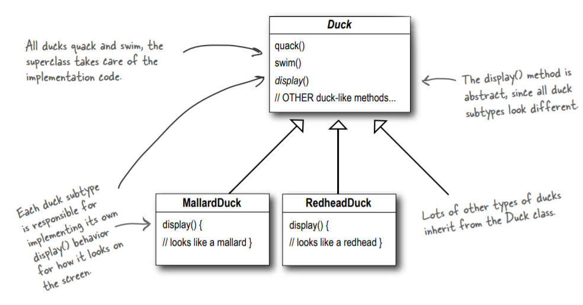
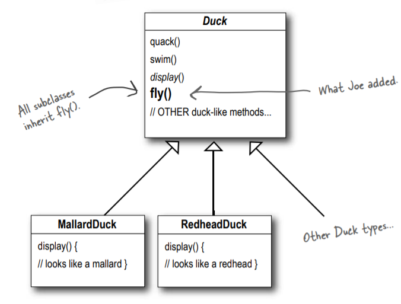
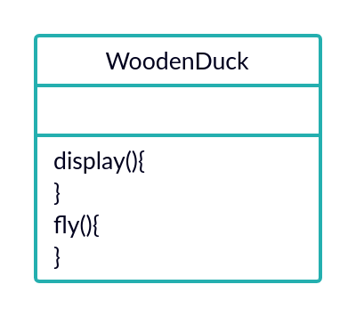
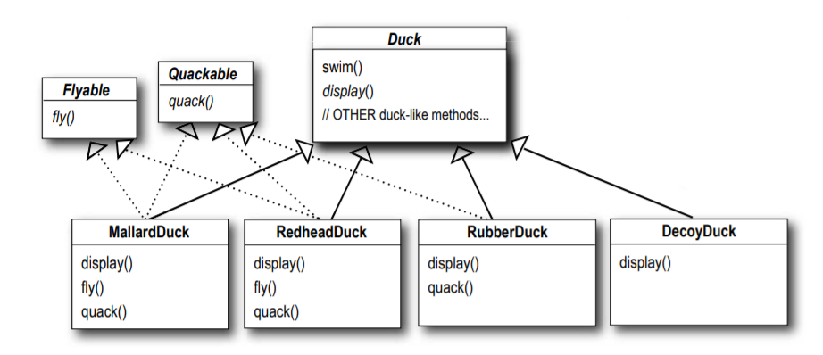
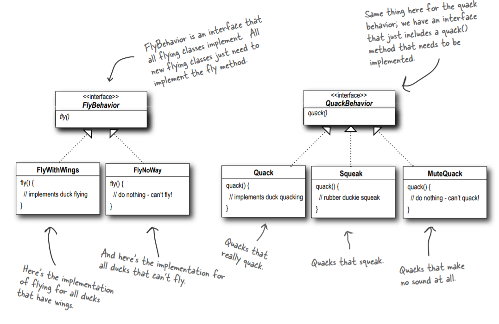
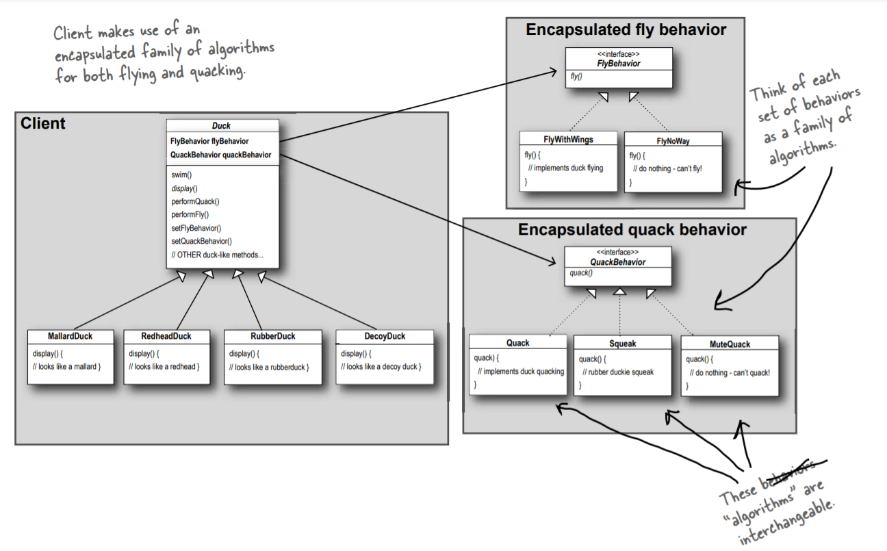

# Strategy: Encapsulate Everything Changable Seperatly

## Abstraction
Its not really easy to recap and understand as It evolves some OOD&A theories, and good understanding in OOP too, but I tried my very best to explain it.

## Motivation
    A: hello, Its been a while since we worked together. I'm excited that we get to work again in the new application.
    B: Yup, me too!. So tell me, what's the case?

    A: We're now asked to build a duck simulation game where we have several types of ducks and we have to implement
    some of its functionalities. How do you think we should design such software?

    B: Nah, too easy. Just create a superclass "Duck" and let the several types of ducks be the subclasses which 
    inherit its behaviour. It should look like that.

    A: Ok thats good. But what we want our ducks to fly, what should we do?
    B: Then just add a "fly" method to the "Duck" superclass and let the other subclasses inherit it and override
    that however you want. I'm super genuis in OOP stuff. Yeah yeah I know thank you, no need for much praise here.

    B: This is how it should be like:

    A: Hmmm, I'm not really sure If this is the best solution or not. What If we had a class like "WoodenDuck"? They 
    shouldn't be flying IMO. You thought that code reusability could solve it, but this brough some servious maintenance
    problems. In that case, overriding the "fly()" method in non-flying subclasses to do absolutley nothing is so screwed. 

 

    B: Bruh, then just use interfaces since not all the the ducks (subclasses) can fly, same for qucking since not all ducks
    can quack too, and let the classes whatever they want.

 

    A: Congratulations, you are amazing. You create a new problem which's worse a dozen times that the old problem.
    Let's imagine we have 50 different types of ducks which cannot fly, do you know how many time will you implement (Change) 
    the "fly" function in these classes?
    B: Holy man. Ok I give up, how should we solve this? :"

    A: Here's a free tip from an old friend you should stick to.
> *Identify the aspects of your application that vary and separate them from what stays the same*

    A: What It means that: Take the parts that vary and encapsulate them, so later you can alter or extend the parts that
    vary without affecting those that can't.

    B: English, please?

    A: Ok. What I mean is that, we will make sets of classes for Flying behaviour, each of the will have its own implementation 
    for flying method. Like this.

    B: Ok sound great, but how are we going to define the set of classes that implement the fly behaviour?

    A: Here's another free tip from old geek guy.

> _Program to an interface, not an implementation_

    B: I don't understand language of Mars people. :"

    A: Hahaha its ok. `interface` here means having an abstraction of what kind of behaviour we want to have across all
    the subclass, it doesn't mean the actual "interface" keyword as most people understand.

    B: Ok, I'm listening.

    A: Since we had our interfaces for the varied duck behaviours like quacking and flying, each behaviour of these will
    have its classes implemented from its interface and writing its implementation. Thus, the implementation won't be locked
    inside the superclass "Duck" or its subclasses anymore. Besides, you can change the flying behaviour of a Duck anytime
    you want, you can make it fly, change it to non-flying during runtime (Since we'll have an instance of both interfaces
    in the superclass). This wasn't possible in the begenning :) 

 

    A: Now for the final review of the UML.

 

    B: You're still nasty AF bro, kudos for this effort. You're the real OOP master here :)

    A: Sure thing. Congratulations, you now learned a new design pattern, the strategy!
