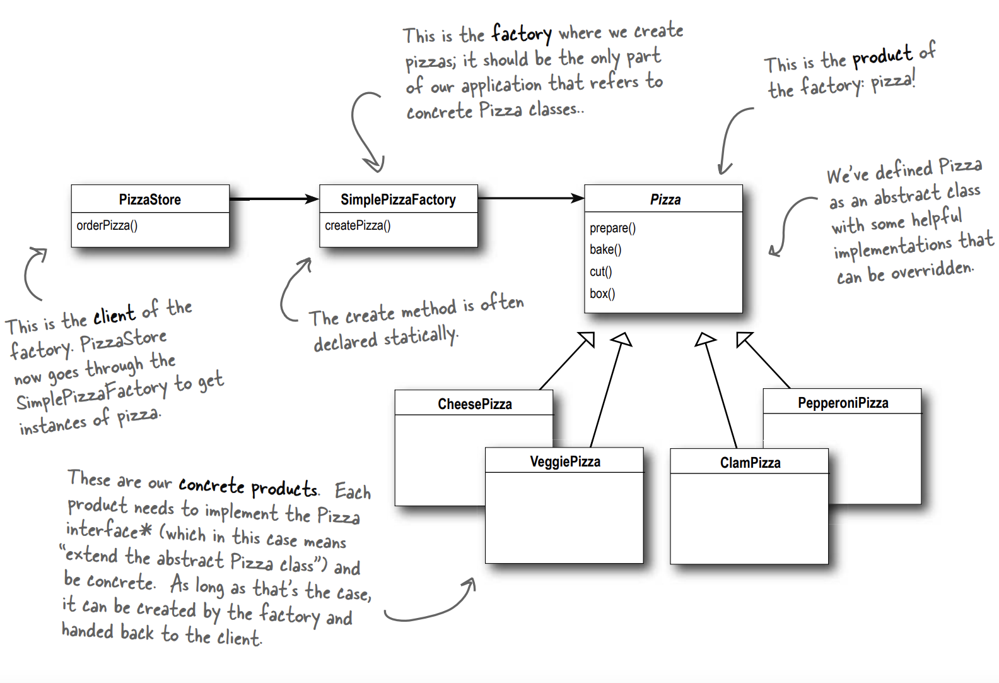

# Factory: We Sell Everything Here!

## Abstraction
It will be the easiest one to grap-up here, a little bit follow for some OOD principle will do the trick here.

## Motivation
Here is a conversation between two Engineers discussing about its importance :)
    
    A: Welcome back buddy. Long time no see!
    B: Yeah you too, its been a while.

    A: Yup. As usual, we have a new challenge to overcome. We'll build software simulating a Pizza store
    where customer can order pizza.
    What do you think?

    B: I don't think this one will be much of a problem than the others, you can start giving ideas :)
    A: Ok. Here is whats in my mind. We'd have a "Pizza" abstract class with several methods to implement like
        - Baking
        - Preparing
        - Cutting
        - Boxing
        - etc.
    And make other subclasses (Different types of pizzas) to inhert these methods.
    B: Ok, this is a good start. What else?

    A: Then, in the client, we'd make a method called "orderPizza" and based on the specified type of pizza, 
    we'd make an instance of that subclass. Like that.

```TypeScript
    public orderPizza(type: string): Pizza{
        let pizza: Pizza;

        if(type === 'cheese'){
            pizza = new CheesePizza();
        } else if(type === 'pepperoni'){
            pizza = new PepperoniPizza();
        } else if(type === 'greek'){
            pizza = new GreekPizza();
        }
        return pizza;
    }
```
    B: As a start, this seems to be great for me. But this restaurant will have a lot of competitors,
    in addition to that, lots of crazy cheifs likes to make their own pizza style, thus add new pizzas'.
    In terms of that code, everywhere you have the "orderPizza" method anywhere in the class, you've 
    to change it everywhere and add the new type of pizza. This will be a pain in the ass.

```TypeScript
    public orderPizza(type: string): Pizza{
        let pizza: Pizza;

        if(type === 'cheese'){
            pizza = new CheesePizza();
        } else if(type === 'pepperoni'){
            pizza = new PepperoniPizza();
        } else if(type === 'greek'){
            pizza = new GreekPizza();
        } 
        // New pizzas (In another like 5 classes)
        else if(type === 'nuggets'){
            pizza = new NuggetsPizza();
        } else if(type === 'veggie'){
            pizza = new VeggiePizza();
        }
        return pizza;
    }
```

    A: I saw that coming honestly. You never liked my approaches not for a once.


    B: Haha, no you did a good job! But there is a thing you should keep in mind.

## Implementation Discuss


> According to one of the S.O.L.I.D priciples, your class(es) should be: _Open for extension, closed for modification_.

    B: Everytime you want to add a new type of pizza, you have to hardcode it everwhere in the codebase
    and modify that method. Maybe
    having somekind of wrapper to every clinet wants to access this method will be much better.
    That is from where we should have a FACTORY to all of the clients.

```TypeScript
    public class SimplePizzaFactory{
        public createPizza(type: string): Pizza{
            let pizza: Pizza | null = null;
            if(type === 'cheese'){
                pizza = new CheesePizza();
            } else if(type === 'pepperoni'){
                pizza = new PepperoniPizza();
            } else if(type === 'greek'){
                pizza = new GreekPizza();
            }
            return pizza; 
        }
    }
```
    B: Lastly, we can use our new Factory like that:

```TypeScript
    public class PizzaStore{
        pizzaFactory: SimplePizzaFactory;
        constructor(pizzaFactory: SimplePizzaFactory){
            this.pizzaFactory = pizzaFactory;
        }

        public orderPizza(type: string): Pizza{
            const pizza = pizzaFactory.createPizza(type);

            pizza.prepare();
            pizza.bake();
            pizza.cut();
            pizza.box();

            return pizza;
        }
    }
```
    B: Here is the final picture of our UML.



    A: As usual, you acomplished everything here. Yay, you saved the day.
    B: Not really, you helped a lot tbh. Let's see what we'd do next. :)
