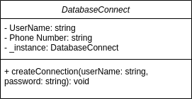

# Singleton: One-of-a-kind Object

## Abstraction
It might be one the simplest design patterns in terms of class diagram (It has only one class!), but It actually needs good understanding of object-oriented thinking in its implementation.

## Motivation
Here is a conversation between two Engineers discussing about its importance :)
    
    
    A: Why do we even use it?

    B: Where are many objects that may be instanciated from a class and we're only 
    interested in one like: Thread pools, Caches, dialog boxes, and database connections, 
    instanciating any other object will result in overusing available resources for the application, 
    therefore making them busy, or even lead to misbehavoiur.

    A: Ok, so Instead of using one object for them, why just not using a global variable? Easy beasy 😃

    B: Its not going to be that simple, what If It will come from a resource-intensive thing and you might not
     use it in the end? Singleton will make a use of it if necessary.


    A: Ok, this doesn't seem to be really difficult.

    B: Not really, unless you're fimiliar static class variables and methods, in addition to access modifiers.

    A: Sure thing, but how do we make a use of them?

## Implementation Discuss

    B: How would you make a object from `DatabaseConnection` class ?

    A: new `DatabaseConnection`()

    B: Good, how many objects can you make from the class. One, two, or how many?

    A: As long as there is a free space in the heap memory I guess and the class is public.

    B: Lovely, what If its is private like that?

```typescript
class DatabaseConnect {
    private constructor(){

    }
}
```

    A: Hmm, It won't be possible to instanciate one from it if its private. I can only call the 
    constructor within the class itself, than doesn't make much of a sense for me 🤕
    
    B: Excellent, can you tell me that this means?

```typescript
class DatabaseConnect {
    public static DatabaseConnect getInstance() {

    }
}
```
    A: This is a static method where I can call it like that. `DatabaseConnect.getInstance()`

    B: Good, why you used the class name to call it?

    A: Because it is a static method; in other words, it is a CLASS method. You need to use the 
    class name to reference a static method.

    B: Perfect. What If we put all things together? 
    Can I now Instanciate my class?

```typescript
class DatabaseConnect {

    private constructor(){

    }

    public static MyClass getInstance() {
        return new DatabaseConnect();
    }
}
```
    A: WOW, you sure can.

    B: So, can we now finish the code with ONLY ONE instance of the class?

    A: Yes, I think so.


## UML Diagram


